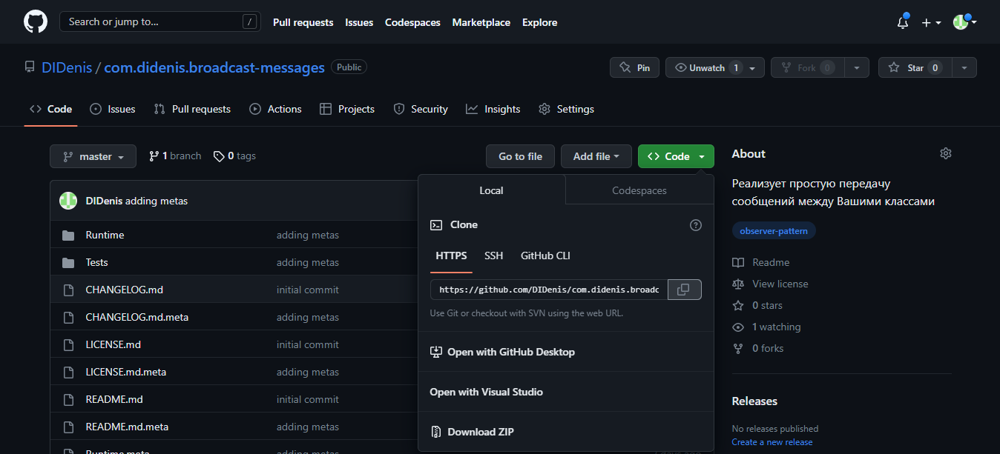
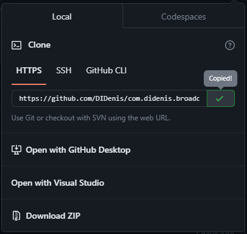
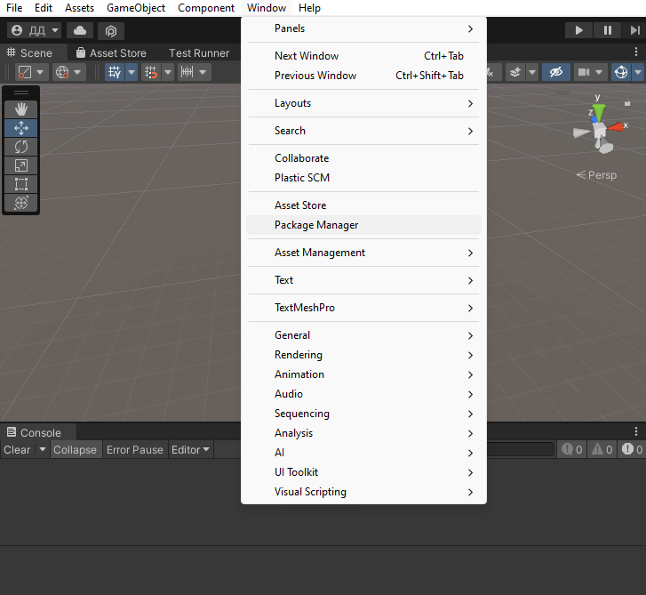
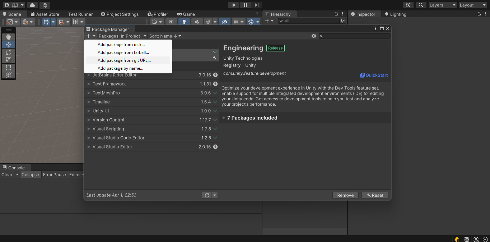
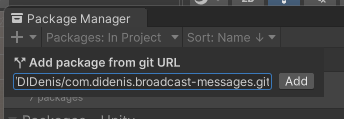
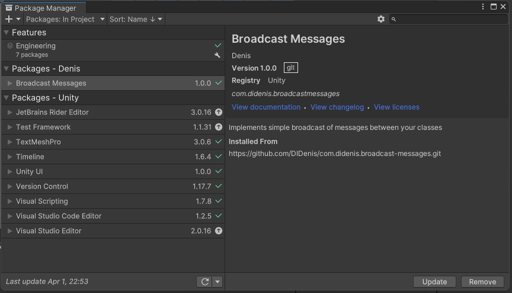

# Broadcast Messages

## Setup

1. Click on the green button "Code"

    

2. Then click on copy button, in "HTTPS" tab

    

3. In Unity open the Package Manager window (Window/Package Manager)

    

4. Then click on plus sign and select "Add package from git URL"

    

5. Insert copied link and click on "Add"

    

6. After sometime this package will be add to your project

    

## How to use

Messenger is basic class, it sends some messages to
all subscribers who subscribe to the broadcast.

For send message without parameters you must write
````c#
Messenger.SendMessage<SomeMessage>();
````

To be able to send SomeMessage, it must be inherits
from abstract class Message

````c#
public class SomeMessage : Message { }
````

For send message with some parameters you must write
````c#
Messenger.SendMessage(new MessageWith1Arg(arg));
Messenger.SendMessage(new MessageWith2Args(arg1, arg2));
````

This messages will look like this
````c#
public class MessageWith1Arg : Message {

    public readonly object arg;
    
    
    public MessageWith1Arg (object arg) {
        this.arg = arg;
    }
    
}
````
````c#
public class MessageWith2Args : Message {

    public readonly object arg1;
    public readonly object arg2;
    
    
    public MessageWith2Args (object arg1, object arg2) {
        this.arg1 = arg1;
        this.arg2 = arg2;
    }
    
}
````

To get a messages in your classes they must be
subscribed to receive of this messages.
Then they can unsubscribes from broadcast
````c#
public class FirstYourClass : MonoBehaviour {
    
    private void Awake () {
        Messenger.SubscribeTo<SomeMessage>(DoSomething);
        Messenger.SubscribeTo<MessageWith1Arg>(DoSomething);
    }
    
    
    private void DoSomething (SomeMessage message) {
        // do anything...
    }
    
    
    private void DoSomething (MessageWith1Arg message) {
        if (message.arg is not null) {
            // do anything...
        }
    }
    
    
    private void OnDestroy () {
        Messenger.UnsubscribeFrom<SomeMessage>(DoSomething);
        Messenger.UnsubscribeFrom<MessageWith1Arg>(DoSomething);
    }
    
}
````
````c#
public class SecondYourClass : MonoBehaviour {
    
    private void Awake () {
        Messenger.SubscribeTo<SomeMessage>(DoSomething);
        Messenger.SubscribeTo<MessageWith2Args>(DoSomething);
    }
    
    
    private void DoSomething (SomeMessage message) {
        // do anything...
    }
    
    
    private void DoSomething (MessageWith2Args message) {
        if (message.arg1 is message.arg2) {
            // do anything...
        }
    }
    
    
    private void OnDestroy () {
        Messenger.UnsubscribeFrom<SomeMessage>(DoSomething);
        Messenger.UnsubscribeFrom<MessageWith2Args>(DoSomething);
    }
}
````